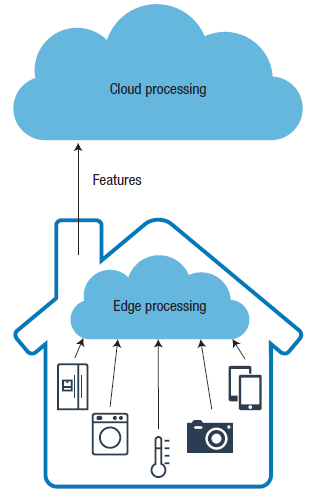
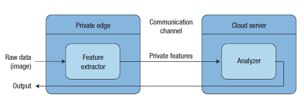

# Private and Scalable Personal Data Analytics Using Hybrid Edge-to-Cloud Deep Learning

### [Private and Scalable Personal Data Analytics Using Hybrid Edge-to-Cloud Deep Learning](https://github.com/jungwonrs/JwRalph_Seo/blob/master/papers/private%20and%20scalable%20personal%20data%20analytics%20using%20hybrid%20edge%20to%20cloud%20deep%20learning.pdf)

----

## 들어가며

Cyber-Physical System과 IoT의 발전은 인터넷과 실제 세상과 상호작용을 통해 많은 변화를 불러 일으키고 있습니다.
오늘날 스마트 기기와 같은 센서 기기들은 보안 모니터링, 건강 모니터링, 스마트 도시 건설등의 목적으로 대량의 사용자 데이터를 수집하고 지속적으로 전송하고 있습니다.
대다수의 IoT 장치는 지속적으로 온라인 상태로 데이터를 수집하고, 데이터를 분석하기 위해서 클라우드 기반 머신러닝 어플리케이션에 의존합니다.

---

## 논문에서 이야기하는 문제

오늘날 기업용 클라우드 컴퓨팅을 사용하여 비용 절감 효과와 빠른 성능을 제공 받을 수 있으나, 클라우드 컴퓨팅은 몇몇 잠재적인 문제들을 가지고 있습니다.

1. IoT 기기들의 발전 및 늘어난 기기들로 인해 발생할 수 있는 네트워크 병목 (bottlneck) 현상
2. 늘어난 데이터로 인한 IoT 기기들의 에너지 소모 문제
3. 개인정보 문제

위의 문제들을 해결하기 위한 방안으로서, 그림1과 같이 에지 컴퓨팅(Edge Computing)를 사용하는 방법들이 제안되고 있습니다.

  

_그림1.사용자의 데이터가 에지 노드(Edge Node)에서 로컬로 수집 및 처리되고, 처리된 데이터를 클라우드 데이터 센터로 전송되는 형태_

실제 환경에서는 다양한 방법으로 개인정보가 노출이 되고 있습니다.  

1. 이미지를 통한 노출: 스마트폰 카메라를 통한 얼굴 인식, 연령 추정, 성별 분류, 감정 감지등을 통한 노출

2. 비디오를 통한 노출: CCTV에 의한 시각적 움직임 노출

3. 언어를 통한 노출: 다양한 음성인식 IoT 기기들의 발전으로 인한 음성 노출

개인정보가 노출되는 문제를 해결하고자 본 논문에서는 그림1과 같은 에지 컴퓨팅을 사용하여 개인정보를 보호하는 방법에 대해서 이야기 하고자 합니다.  

---

## 논문의 해결책  

본 논문에서는 개인정보 데이터 처리 장치와 클라우드 서비스간에 데이터 처리가 이루어질수 있는 하이브리드 에지 투 클라우드 (Hybrid Edge-to-Cloud) 아키텍처를 소개합니다.
제안하는 아키텍처를 통해 사전에 개인정보 문제를 해결하고, 최종 사용자가 클라우드 처리 효율성의 이점을 누릴 수 있을것이라 기대할수 있습니다.
논문에서 제안하는 아키텍처를 간략하게 표현하면 그림2와 같습니다.

  

_그림2. 제안하는 프레임워크 형태; 에지 노드를 통해 기능 추출을 하여 데이터에서 중요한 정보를 제공하고, 클라우드를 통해 추출된 데이터를 추론하는 형태_

해당 아키텍처의 프로세스는 다음과 같습니다.
1. 기본 데이터는 개인 장치 (에지 노드)로 부터 수집이 되어 형상 추출기로 전송이 된다.
2. 추출기는 입력된 데이터를 가지고 새로운 중간 데이터를 출력한다.
3. 중간 데이터를 클라우드로 전송한다.
4. 개인장치는 중간 데이터를 수신하여 필요한 경우 결과를 클라이언트에 반환한다.  

해당 아키텍처에 사용하기 위한 입력 데이터는 두 가지 속성을 가지고 있어야 합니다;  

 _사용자의 특징을 추론이 어느정도 가능한 데이터,_ _사용자의 민감한 정보를 추론할수 없는 데이터_  

어떠한 데이터를 선택하는것도 중요하지만, 추출기 모듈을 설계하는 것이 중요합니다. 추출기는 중요한 정보를 보호하는 동시에 기본 작업에 필요한 정보를 보관하는 기능이 있어야 하며,
사용자의 개인 장치를 사용하기 때문에 복잡한 루틴이 있어서는 안됩니다. 추출기는 아주 간단한 형태로 설계가 될 수도 있으며, 추출기는 분석기의 결과에 영향을 끼칠수 없는 구조로 설계가 되어야 합니다.

추출기가 작동할 수 있는 예시 다음과 같습니다.  

_이미지 데이터에서 얼굴을 감지하여 음영 영역으로 대체,_ _음성 데이터에서 음의 주파수를 변경_  

#### 딥러닝 적용

제안된 아키텍처

---

## 실험

ㅁㅇㅁㄴㄻㄹ

---

## 결론

ㅁㅇㅁㄴㄻㄹ

---

## 개인 의견

ㅁㅇㄴㄻㄻㅇㄴ

---
