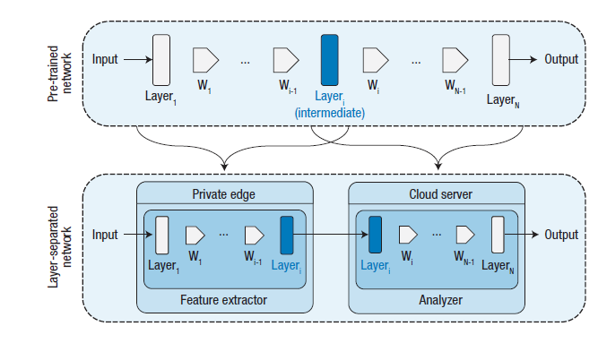
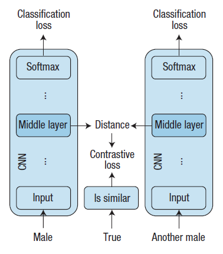
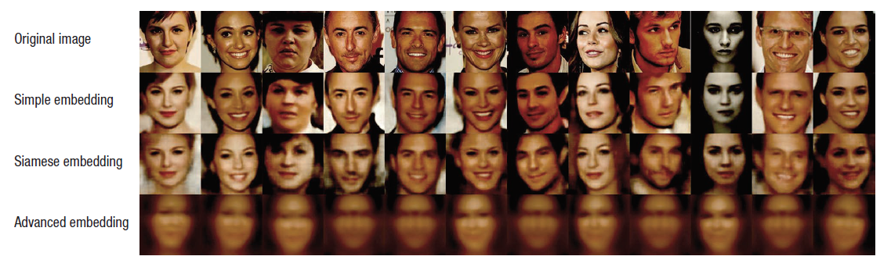

# Private and Scalable Personal Data Analytics Using Hybrid Edge-to-Cloud Deep Learning

### [Private and Scalable Personal Data Analytics Using Hybrid Edge-to-Cloud Deep Learning](https://github.com/jungwonrs/JwRalph_Seo/blob/master/papers/private%20and%20scalable%20personal%20data%20analytics%20using%20hybrid%20edge%20to%20cloud%20deep%20learning.pdf)

----

## 들어가며

Cyber-Physical System과 IoT의 발전은 인터넷과 실제 세상과 상호작용을 통해 많은 변화를 불러 일으키고 있습니다.
오늘날 스마트 기기와 같은 센서 기기들은 보안 모니터링, 건강 모니터링, 스마트 도시 건설등의 목적으로 대량의 사용자 데이터를 수집하고 지속해서 전송하고 있습니다.
대다수의 IoT 장치는 지속해서 온라인 상태로 데이터를 수집하고, 데이터를 분석하기 위해서 클라우드 기반 머신러닝 어플리케이션에 의존합니다.

---

## 논문에서 이야기하는 문제

오늘날 기업용 클라우드 컴퓨팅을 사용하여 비용 절감 효과와 빠른 성능을 제공 받을 수 있으나, 클라우드 컴퓨팅은 몇몇 잠재적인 문제들을 가지고 있습니다.

1. IoT 기기들의 발전 및 늘어난 기기들로 인해 발생할 수 있는 네트워크 병목 (bottlneck) 현상
2. 늘어난 데이터로 인한 IoT 기기들의 에너지 소모 문제
3. 개인정보 문제

위의 문제들을 해결하기 위한 방안으로서, 그림1과 같이 에지 컴퓨팅(Edge Computing)를 사용하는 방법들이 제안되고 있습니다.

  

_그림1. 사용자의 데이터가 에지 노드(Edge Node)에서 로컬로 수집 및 처리되고, 처리된 데이터를 클라우드 데이터 센터로 전송되는 형태_

실제 환경에서는 다양한 방법으로 개인정보가 노출이 되고 있습니다.  

1. 이미지를 통한 노출: 스마트폰 카메라를 통한 얼굴 인식, 연령 추정, 성별 분류, 감정 감지등을 통한 노출

2. 비디오를 통한 노출: CCTV에 의한 시각적 움직임 노출

3. 언어를 통한 노출: 다양한 음성인식 IoT 기기들의 발전으로 인한 음성 노출

개인정보가 노출되는 문제를 해결하고자 본 논문에서는 그림1과 같은 에지 컴퓨팅을 사용하여 개인정보를 보호하는 방법에 관해서 이야기 하고자 합니다.  

---

## 논문의 해결책  

본 논문에서는 개인정보 데이터 처리 장치와 클라우드 서비스 간에 데이터 처리가 이루어질 수 있는 하이브리드 에지 투 클라우드 (Hybrid Edge-to-Cloud) 아키텍처를 소개합니다.
제안하는 아키텍처를 통해 사전에 개인정보 문제를 해결하고, 최종 사용자가 클라우드 처리 효율성의 이점을 누릴 수 있을 것이라 기대할 수 있습니다.
논문에서 제안하는 아키텍처를 간략하게 표현하면 그림2와 같습니다.

  

_그림2. 제안하는 프레임워크 형태; 에지 노드를 통해 기능 추출을 하여 데이터에서 중요한 정보를 제공하고, 클라우드를 통해 추출된 데이터를 추론하는 형태_

해당 아키텍처의 프로세스는 다음과 같습니다.
1. 기본 데이터는 개인 장치 (에지 노드)로 부터 수집이 되어 형상 추출기로 전송이 된다.
2. 추출기는 입력된 데이터를 가지고 새로운 중간 데이터를 출력한다.
3. 중간 데이터를 클라우드로 전송한다.
4. 개인 장치는 중간 데이터를 수신하여 필요한 경우 결과를 클라이언트에 반환한다.  

해당 아키텍처에 사용하기 위한 입력 데이터는 두 가지 속성을 가지고 있어야 합니다;  

 _사용자의 특징을 추론이 어느 정도 가능한 데이터,_ _사용자의 민감한 정보를 추론할 수 없는 데이터_  

어떠한 데이터를 선택하는 것도 중요하지만, 추출기 모듈을 설계하는 것이 중요합니다. 추출기는 중요한 정보를 보호하는 동시에 기본 작업에 필요한 정보를 보관하는 기능이 있어야 하며,
사용자의 개인 장치를 사용하기 때문에 복잡한 루틴이 있어서는 안 됩니다. 추출기는 아주 간단한 형태로 설계가 될 수도 있으며, 추출기는 분석기의 결과에 영향을 끼칠 수 없는 구조로 설계가 되어야 합니다.

추출기가 작동할 수 있는 예시 다음과 같습니다.  

_이미지 데이터에서 얼굴을 감지하여 음영 영역으로 대체,_ _음성 데이터에서 음의 주파수를 변경_  

#### 딥러닝 적용

딥러닝을 적용하기 위한 아키텍처는 그림3과 같습니다.

_그림3. 층 분리 메커니즘. 첫 계층은 형상 추출기에 해당하며 나머지 계층은 분석기에 해당_  

본 논문에서는 가장 인기 있는 데이터 처리 방법인 CNN (Convolutional Neural Networks)를 사용합니다.
그림2에서 제안된 아키텍처에 CNN을 접목하는 다음과 같습니다.
1. 층분리를 위해서 중간 레이어 (Intermediate Layer)를 선택합니다.
2. 중간 레이어 이전의 레이어는 형상 추출용 레이어로 정의하여 개인장치에서 동작합니다.
3. 중간 레이어 이후의 레이어는 분석용 레이어로 정의하여 클라우드에서 동작합니다.

중간 레이어를 선택할 때는 트래이드 오프가 (Trade Off)가 존재한다는 것을 알고 설계를 해야 합니다.
중간 레이어를 뒤쪽 레이어에서 선택하는 것은 민감한 정보에 대한 프라이버시(Privacy)를 높이는 결과를 가져올 수 있지만
개인 장치에서 계산해야 되는 계산 비용도느는 결과를 가져올 수 있습니다.

본 논문에서는 프라이버시를 증가를 위해서 Siamese Embedding 방식을 사용하여 딥러닝 튜닝을 진행하였습니다. Siamese 아키텍처 학습 모델을 훈련하는 일반적인 방법으로 두 개의 이미지가 같은 사람인지 여부를 판별하기 위해 얼굴 인식 어플리케이션에서 자주 사용됩니다. Siamese 아키텍처를 사용하여 데이터를 미리 학습시키고, 미리 학습된 데이터를 사용하여 CNN을 사용한다면 더욱더 정교한 결과를 얻어낼 수 있습니다. Siamese 아키텍처를 활용한 튜닝 방식은 그림4와 같이 표현할 수 있습니다.

_그림4. Siamese 튜닝 방법. 두 남성 얼굴 이미지의 중간 형상은 CNN을 통해서 추출이 되며, 유사점이 있으면 CNN의 레이어의 간격은 가까워야 함._  

또한 머신러닝의 성능을 향상하기 위해서 CNN의 차원수를 줄이는 방법을 사용하였습니다.  

차원수 감소 (Dimensionality Reduction) 방식은 통계 및 기계 학습의 다양한 응용분야에서 사용되고 있습니다. 차원 수를 줄이는 방법으로 가장 보편적인 방식은 PCA (Principal Component Analysis)방식입니다. PCA는 선형 변환 (Linear Transacformation)을 사용하며, 매트릭스의 곱셈을 통해 차원의 재구성과 감소를 만족할 수 있습니다. PCA 방식을 사용하더라도 Siamese 튜닝의 성능은 저하되지 않으며 오히려 클라우드와의 통신비용을 절감시키면서 프라이버시를 지키는 효과를 유지할 수 있습니다.  

본 논문에서는 에지 컴퓨팅, CNN, Siamese 튜닝, PCA를 사용하여 실험을 진행하였습니다.

---

## 실험

본 논문에서는 얼굴 이미지를 통한 실험을 진행하였습니다. 또한, Rasmus Rothe 와 그의 동료들이 제안한 성별 분류 모델인 VG-16를 사용하였으며, 5개의 Concolutional Layer를 설계하였습니다.  

논문의 저자들이 제안하는 아키텍처를 사용할 경우 메모리 사용량을 50%까지 낮출 수 있고, 스마트폰의 로딩 시간은 20% 미만으로 낮춰지는 결과를 가져왔습니다. 해당 결과는 저자들이 제안하는 아키텍처의 효율성이 기존 다른 방식과 비교하였을 때 효율성이 높다는 결론을 내릴 수 있습니다.  

또한, 프라이버시를 지키기 위해서 여러 개의 사진들을 Simple Embedding, Siamese Embedding, Advanced Embedding을 적용해 각각의 사진들의 성별이 원본 사진의 성별과 동일하게 인식이 가능한지 실험을 진행하였습니다.

_그림5. 개인정보 보호를 위한 다양한 모델 비교_  

그림5에서 첫 번째 줄은 원본 사진을 의미하고 밑으로 내려갈수록 점차 성별을 맨눈으로 확인할 수 없도록 하고 있습니다.  
실험을 통해 재구성된 모든 사진은 원본과 동일한 성별로 인식을 하였습니다. 또한 Advanced Embedding 방식이 최고의 프라이버시 보호 성능을 가지고 있음을 확인할 수 있습니다.

---

## 결론

저자들은 본 연구의 한계로는 이미 학습된 머신러닝 데이터셋을 사용하였다고 이야기합니다. 그들은 향후 클라우드에서 스스로 학습을 진행하며, RNN과 같은 다른 딥러닝 기술을 적용하는 연구를 지속해서 진행할 것이라 밝혔습니다.

---

## 개인 의견

개인적인 의견으로는 에지 컴퓨팅, CNN, Siamese 튜닝, PCA 기법을 사용하여 사용자의 프라이버시를 보호하기 위한 접근 방식은 흥미로웠습니다. 하지만 논문에서 자세한 알고리즘의 설명 없이 아키텍처만을 제시하고 있는 것이 논문을 읽는 동안 아쉬움으로 남았습니다. 또한, 실험에서 보여준 사용자의 프라이버시 보호의 개념을 성별을 인식하지 못하도록 하는 것에 국한된다는 점이 추가적인 아쉬움으로 남았습니다.

---
